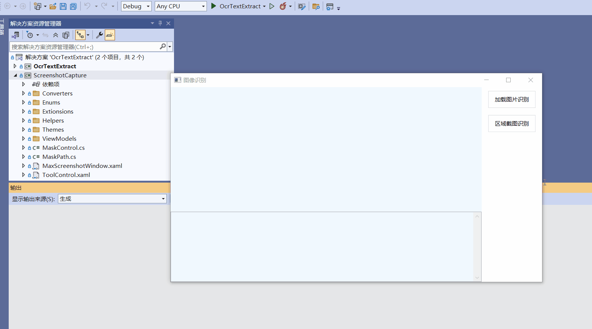

#### 代码添加
```
/// <summary>
/// 截图事件
/// </summary>
private void btnCutExtract_Click(object sender, RoutedEventArgs e)
{
    // 隐藏50ms毫秒, 避免当前窗口被拉入到中截图
    this.Hide();
    Thread.Sleep(50);

    MaxScreenshotWindowViewModel viewModel = new MaxScreenshotWindowViewModel();
    viewModel.OnSaveEvent += ViewModel_OnSaveEvent;
    viewModel.OnCancelEvent += ViewModel_OnCancelEvent;
    viewModel.SetStyles(s =>
    {
        // s.ToolBackgroundColor = ColorHelpers.FromString("#F2F2F2");
    });

    viewModel.ShowCapture();
}
```
#### 预览效果


